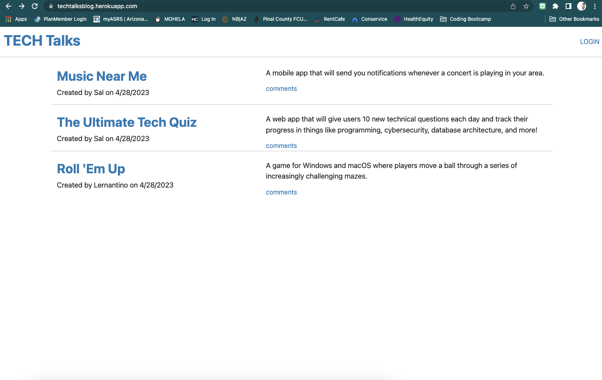
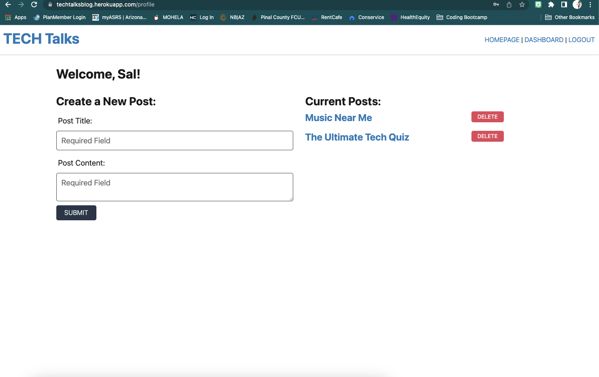

# MVC: Tech-Blog

## Description
A mysql database and CMS-style Blog, where developers can publish their blog posts and comment on other developers’ posts as well. Built using the MVC paradigm in its architectural structure, Handlebars.js as the templating language, Sequelize as the ORM, and the express-session npm package for authentication.

## Table of Contents
- [User-Story](#user-story)
- [Usage](#usage)
- [Application Schreenshot](#application-screenshot)
- [Deployment Links](#link)
- [Author](#author)

## User Story
AS A developer who writes about tech

I WANT a CMS-style blog site

SO THAT I can publish articles, blog posts, and my thoughts and opinions

## Usage
To use this Collection Keeper, register for an account on the website and sign in on the sign in page. From there, you can input the information on your items, including: name, description, date, and location. Your items will be saved to your account or can be deleted as you click the delete button.

## Application Screenshot

## Deployed Link

[GitHub repo](https://github.com/jeannav/Tech-Blog)

[Heroku git URL](https://techtalksblog.herokuapp.com/)

### Author

[@jeannav](https://github.com/jeannav)

